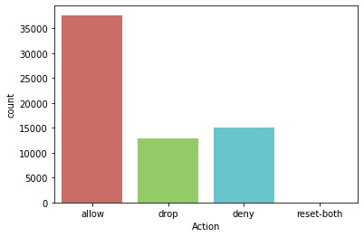
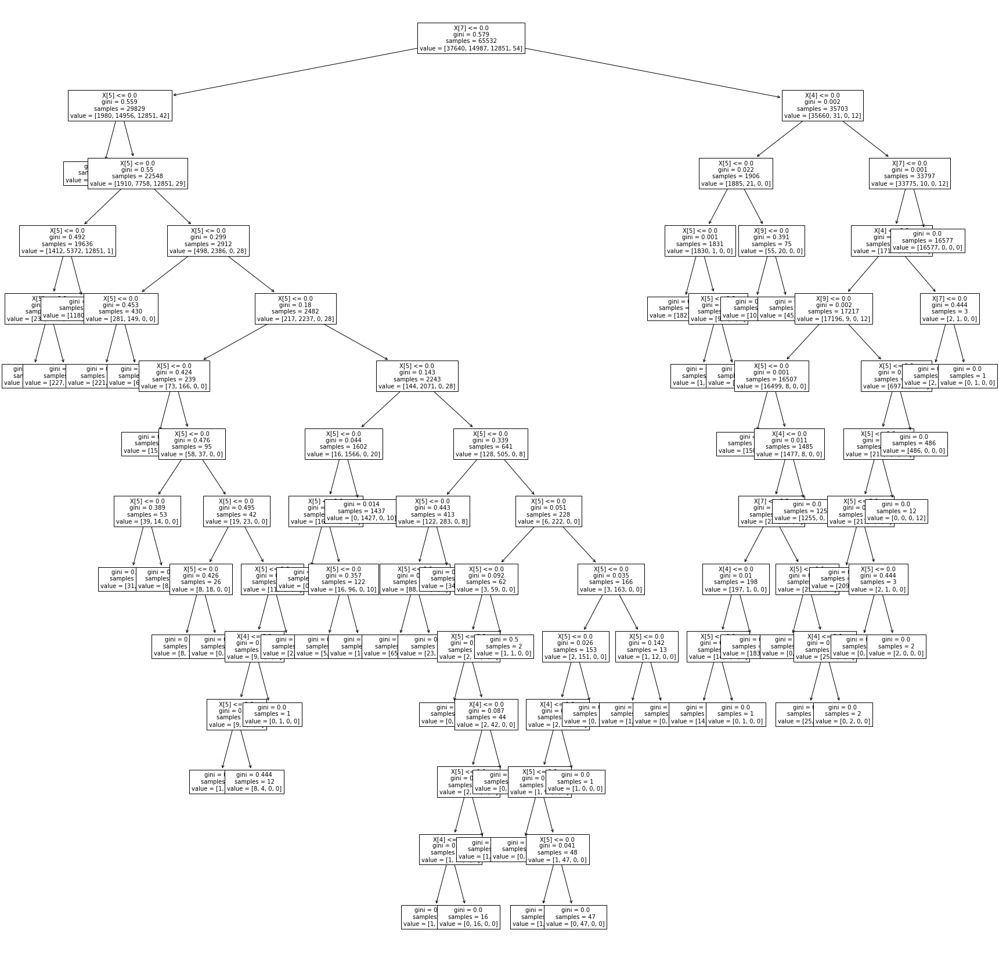

```python
# Author : Amir Shokri
# github link : https://github.com/amirshnll/Internet-Firewall
# dataset link : http://archive.ics.uci.edu/ml/datasets/Internet+Firewall+Data
# email : amirsh.nll@gmail.com
```


```python

import pandas as pd
import seaborn as sns
import matplotlib.pyplot as plt
import numpy as np


df = pd.read_csv('firewall.csv')
df

```


<div>
<style scoped>
    .dataframe tbody tr th:only-of-type {
        vertical-align: middle;
    }

    .dataframe tbody tr th {
        vertical-align: top;
    }

    .dataframe thead th {
        text-align: right;
    }
</style>
<table border="1" class="dataframe">
  <thead>
    <tr style="text-align: right;">
      <th></th>
      <th>Source Port</th>
      <th>Destination Port</th>
      <th>NAT Source Port</th>
      <th>NAT Destination Port</th>
      <th>Action</th>
      <th>Bytes</th>
      <th>Bytes Sent</th>
      <th>Bytes Received</th>
      <th>Packets</th>
      <th>Elapsed Time (sec)</th>
      <th>pkts_sent</th>
      <th>pkts_received</th>
    </tr>
  </thead>
  <tbody>
    <tr>
      <th>0</th>
      <td>57222</td>
      <td>53</td>
      <td>54587</td>
      <td>53</td>
      <td>allow</td>
      <td>177</td>
      <td>94</td>
      <td>83</td>
      <td>2</td>
      <td>30</td>
      <td>1</td>
      <td>1</td>
    </tr>
    <tr>
      <th>1</th>
      <td>56258</td>
      <td>3389</td>
      <td>56258</td>
      <td>3389</td>
      <td>allow</td>
      <td>4768</td>
      <td>1600</td>
      <td>3168</td>
      <td>19</td>
      <td>17</td>
      <td>10</td>
      <td>9</td>
    </tr>
    <tr>
      <th>2</th>
      <td>6881</td>
      <td>50321</td>
      <td>43265</td>
      <td>50321</td>
      <td>allow</td>
      <td>238</td>
      <td>118</td>
      <td>120</td>
      <td>2</td>
      <td>1199</td>
      <td>1</td>
      <td>1</td>
    </tr>
    <tr>
      <th>3</th>
      <td>50553</td>
      <td>3389</td>
      <td>50553</td>
      <td>3389</td>
      <td>allow</td>
      <td>3327</td>
      <td>1438</td>
      <td>1889</td>
      <td>15</td>
      <td>17</td>
      <td>8</td>
      <td>7</td>
    </tr>
    <tr>
      <th>4</th>
      <td>50002</td>
      <td>443</td>
      <td>45848</td>
      <td>443</td>
      <td>allow</td>
      <td>25358</td>
      <td>6778</td>
      <td>18580</td>
      <td>31</td>
      <td>16</td>
      <td>13</td>
      <td>18</td>
    </tr>
    <tr>
      <th>...</th>
      <td>...</td>
      <td>...</td>
      <td>...</td>
      <td>...</td>
      <td>...</td>
      <td>...</td>
      <td>...</td>
      <td>...</td>
      <td>...</td>
      <td>...</td>
      <td>...</td>
      <td>...</td>
    </tr>
    <tr>
      <th>65527</th>
      <td>63691</td>
      <td>80</td>
      <td>13237</td>
      <td>80</td>
      <td>allow</td>
      <td>314</td>
      <td>192</td>
      <td>122</td>
      <td>6</td>
      <td>15</td>
      <td>4</td>
      <td>2</td>
    </tr>
    <tr>
      <th>65528</th>
      <td>50964</td>
      <td>80</td>
      <td>13485</td>
      <td>80</td>
      <td>allow</td>
      <td>4680740</td>
      <td>67312</td>
      <td>4613428</td>
      <td>4675</td>
      <td>77</td>
      <td>985</td>
      <td>3690</td>
    </tr>
    <tr>
      <th>65529</th>
      <td>54871</td>
      <td>445</td>
      <td>0</td>
      <td>0</td>
      <td>drop</td>
      <td>70</td>
      <td>70</td>
      <td>0</td>
      <td>1</td>
      <td>0</td>
      <td>1</td>
      <td>0</td>
    </tr>
    <tr>
      <th>65530</th>
      <td>54870</td>
      <td>445</td>
      <td>0</td>
      <td>0</td>
      <td>drop</td>
      <td>70</td>
      <td>70</td>
      <td>0</td>
      <td>1</td>
      <td>0</td>
      <td>1</td>
      <td>0</td>
    </tr>
    <tr>
      <th>65531</th>
      <td>54867</td>
      <td>445</td>
      <td>0</td>
      <td>0</td>
      <td>drop</td>
      <td>70</td>
      <td>70</td>
      <td>0</td>
      <td>1</td>
      <td>0</td>
      <td>1</td>
      <td>0</td>
    </tr>
  </tbody>
</table>
<p>65532 rows × 12 columns</p>
</div>


```python
df.info() 

```

    <class 'pandas.core.frame.DataFrame'>
    RangeIndex: 65532 entries, 0 to 65531
    Data columns (total 12 columns):
     #   Column                Non-Null Count  Dtype 
    ---  ------                --------------  ----- 
     0   Source Port           65532 non-null  int64 
     1   Destination Port      65532 non-null  int64 
     2   NAT Source Port       65532 non-null  int64 
     3   NAT Destination Port  65532 non-null  int64 
     4   Action                65532 non-null  object
     5   Bytes                 65532 non-null  int64 
     6   Bytes Sent            65532 non-null  int64 
     7   Bytes Received        65532 non-null  int64 
     8   Packets               65532 non-null  int64 
     9   Elapsed Time (sec)    65532 non-null  int64 
     10  pkts_sent             65532 non-null  int64 
     11  pkts_received         65532 non-null  int64 
    dtypes: int64(11), object(1)
    memory usage: 6.0+ MB
    


```python
y = df['Action'].values
y = y.reshape(-1,1)
x_data = df.drop(['Action'],axis = 1)
print(x_data)
```

           Source Port  Destination Port  NAT Source Port  NAT Destination Port  \
    0            57222                53            54587                    53   
    1            56258              3389            56258                  3389   
    2             6881             50321            43265                 50321   
    3            50553              3389            50553                  3389   
    4            50002               443            45848                   443   
    ...            ...               ...              ...                   ...   
    65527        63691                80            13237                    80   
    65528        50964                80            13485                    80   
    65529        54871               445                0                     0   
    65530        54870               445                0                     0   
    65531        54867               445                0                     0   
    
             Bytes  Bytes Sent  Bytes Received  Packets  Elapsed Time (sec)  \
    0          177          94              83        2                  30   
    1         4768        1600            3168       19                  17   
    2          238         118             120        2                1199   
    3         3327        1438            1889       15                  17   
    4        25358        6778           18580       31                  16   
    ...        ...         ...             ...      ...                 ...   
    65527      314         192             122        6                  15   
    65528  4680740       67312         4613428     4675                  77   
    65529       70          70               0        1                   0   
    65530       70          70               0        1                   0   
    65531       70          70               0        1                   0   
    
           pkts_sent  pkts_received  
    0              1              1  
    1             10              9  
    2              1              1  
    3              8              7  
    4             13             18  
    ...          ...            ...  
    65527          4              2  
    65528        985           3690  
    65529          1              0  
    65530          1              0  
    65531          1              0  
    
    [65532 rows x 11 columns]
    


```python
sns.countplot(x='Action',data=df,palette='hls')
plt.show()

```





```python
#normalize data

x = (x_data - np.min(x_data)) / (np.max(x_data) / np.min(x_data)).values
x.head()
```


<div>
<style scoped>
    .dataframe tbody tr th:only-of-type {
        vertical-align: middle;
    }

    .dataframe tbody tr th {
        vertical-align: top;
    }

    .dataframe thead th {
        text-align: right;
    }
</style>
<table border="1" class="dataframe">
  <thead>
    <tr style="text-align: right;">
      <th></th>
      <th>Source Port</th>
      <th>Destination Port</th>
      <th>NAT Source Port</th>
      <th>NAT Destination Port</th>
      <th>Bytes</th>
      <th>Bytes Sent</th>
      <th>Bytes Received</th>
      <th>Packets</th>
      <th>Elapsed Time (sec)</th>
      <th>pkts_sent</th>
      <th>pkts_received</th>
    </tr>
  </thead>
  <tbody>
    <tr>
      <th>0</th>
      <td>0.0</td>
      <td>0.0</td>
      <td>0.0</td>
      <td>0.0</td>
      <td>0.000006</td>
      <td>0.000002</td>
      <td>0.0</td>
      <td>9.651429e-07</td>
      <td>0.0</td>
      <td>0.000000</td>
      <td>0.0</td>
    </tr>
    <tr>
      <th>1</th>
      <td>0.0</td>
      <td>0.0</td>
      <td>0.0</td>
      <td>0.0</td>
      <td>0.000223</td>
      <td>0.000097</td>
      <td>0.0</td>
      <td>1.737257e-05</td>
      <td>0.0</td>
      <td>0.000012</td>
      <td>0.0</td>
    </tr>
    <tr>
      <th>2</th>
      <td>0.0</td>
      <td>0.0</td>
      <td>0.0</td>
      <td>0.0</td>
      <td>0.000008</td>
      <td>0.000004</td>
      <td>0.0</td>
      <td>9.651429e-07</td>
      <td>0.0</td>
      <td>0.000000</td>
      <td>0.0</td>
    </tr>
    <tr>
      <th>3</th>
      <td>0.0</td>
      <td>0.0</td>
      <td>0.0</td>
      <td>0.0</td>
      <td>0.000154</td>
      <td>0.000087</td>
      <td>0.0</td>
      <td>1.351200e-05</td>
      <td>0.0</td>
      <td>0.000009</td>
      <td>0.0</td>
    </tr>
    <tr>
      <th>4</th>
      <td>0.0</td>
      <td>0.0</td>
      <td>0.0</td>
      <td>0.0</td>
      <td>0.001196</td>
      <td>0.000425</td>
      <td>0.0</td>
      <td>2.895429e-05</td>
      <td>0.0</td>
      <td>0.000016</td>
      <td>0.0</td>
    </tr>
  </tbody>
</table>
</div>


```python
#data train & data test
from sklearn.model_selection import train_test_split
x_train, x_test, y_train, y_test = train_test_split(x,y,test_size=0.3,random_state= 300)
print("x_train",x_train.shape)
print("x_test",x_test.shape)
print("y_train",y_train.shape)
print("y_test",y_test.shape)
```

    x_train (45872, 11)
    x_test (19660, 11)
    y_train (45872, 1)
    y_test (19660, 1)
    


```python
#decision tree classifier

from sklearn.tree import DecisionTreeClassifier
from sklearn import metrics
from sklearn import preprocessing
from sklearn.metrics import accuracy_score

dt = DecisionTreeClassifier()
dt = dt.fit(x_train,y_train)
y_forecast=dt.predict(x_test)

from sklearn.metrics import classification_report
print(classification_report(y_test, dt.predict(x_test)))
print('accuracy:{:.4f}'.format(dt.score(x_test, y_test)))

from sklearn import tree
plt.figure(figsize=(30,30))
temp = tree.plot_tree(dt.fit(x,y), fontsize=10)
plt.show()
```

                  precision    recall  f1-score   support
    
           allow       0.99      0.96      0.98     11381
            deny       0.75      0.98      0.85      4456
            drop       0.88      0.67      0.76      3808
      reset-both       0.83      0.33      0.48        15
    
        accuracy                           0.91     19660
       macro avg       0.87      0.74      0.77     19660
    weighted avg       0.92      0.91      0.91     19660
    
    accuracy:0.9074
    





```python
#Nave Bayes Classifier

from sklearn.naive_bayes import GaussianNB

nb = GaussianNB()
nb = nb.fit(x_train, y_train.ravel())
y_forecast=nb.predict(x_test)

from sklearn.metrics import classification_report
print(classification_report(y_test, nb.predict(x_test)))
print('Nave Bayes Classifier{:.4f}'.format(nb.score(x_test, y_test)))
```

    C:\Users\User\anaconda3\lib\site-packages\sklearn\metrics\_classification.py:1221: UndefinedMetricWarning: Precision and F-score are ill-defined and being set to 0.0 in labels with no predicted samples. Use `zero_division` parameter to control this behavior.
      _warn_prf(average, modifier, msg_start, len(result))
    

                  precision    recall  f1-score   support
    
           allow       1.00      0.36      0.53     11381
            deny       0.11      0.14      0.12      4456
            drop       0.37      1.00      0.54      3808
      reset-both       0.00      0.00      0.00        15
    
        accuracy                           0.43     19660
       macro avg       0.37      0.37      0.30     19660
    weighted avg       0.68      0.43      0.44     19660
    
    Nave Bayes Classifier0.4311
    


```python
#Logistic Regreession Classifier

from sklearn.linear_model import LogisticRegression

lr = LogisticRegression(solver='lbfgs')
lr = lr.fit(x_train, y_train.ravel())
y_forecast=lr.predict(x_test)


from sklearn.metrics import classification_report
print(classification_report(y_test, lr.predict(x_test)))
print('accuracy:{:.4f}'.format(lr.score(x_test, y_test)))


```

    C:\Users\User\anaconda3\lib\site-packages\sklearn\metrics\_classification.py:1221: UndefinedMetricWarning: Precision and F-score are ill-defined and being set to 0.0 in labels with no predicted samples. Use `zero_division` parameter to control this behavior.
      _warn_prf(average, modifier, msg_start, len(result))
    

                  precision    recall  f1-score   support
    
           allow       0.58      1.00      0.73     11381
            deny       0.00      0.00      0.00      4456
            drop       0.00      0.00      0.00      3808
      reset-both       0.00      0.00      0.00        15
    
        accuracy                           0.58     19660
       macro avg       0.14      0.25      0.18     19660
    weighted avg       0.34      0.58      0.42     19660
    
    accuracy:0.5789
    


```python
#Knn Classifier
from sklearn.neighbors import KNeighborsClassifier
K = 1
knn = KNeighborsClassifier(n_neighbors=K)
knn = knn.fit(x_train,y_train.ravel())
print("k = {}neighbors , knn test:{}".format(K, knn.score(x_test, y_test)))
print("knn = {}neighbors , knn train:{}".format(K, knn.score(x_train, y_train)))

ran = np.arange(1,40)
train_list = []
test_list = []
for i,each in enumerate(ran):
    knn = KNeighborsClassifier(n_neighbors=each)
    knn = knn.fit(x_train, y_train.ravel())
    test_list.append(knn.score(x_test, y_test))
    train_list.append(knn.score(x_train, y_train))
    
print("best test {} , k={}".format(np.max(test_list),test_list.index(np.max(test_list))+1))
print("best train {} , k={}".format(np.max(train_list),train_list.index(np.max(train_list))+1))
```

    k = 1neighbors , knn test:0.8978128179043744
    knn = 1neighbors , knn train:0.8984129752354377
    


```python
#mlp classifier
from sklearn.neural_network import MLPClassifier
clfm = MLPClassifier(hidden_layer_sizes=(5,), max_iter=1000)
clfm.fit(x_train, y_train.ravel())
y_predm = clfm.predict(x_test)
print("ACCTURACY:", metrics.accurecy_score(y_test, y_predm))
print(classification_report(y_test, clfk.predict(x_test)))
print("mlp:", clfk.score(x_test, y_test))
```
